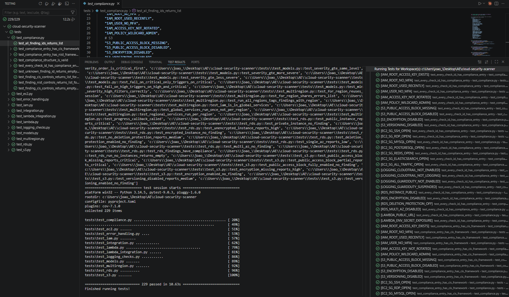
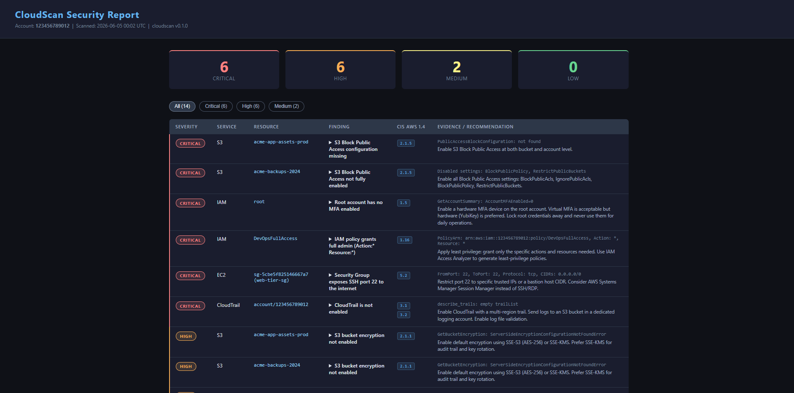

# cloudscan - AWS Cloud Security Scanner

> A Python CLI that scans AWS accounts for security misconfigurations, maps findings to CIS AWS Benchmark controls, and generates terminal, JSON, HTML, and SARIF reports.

[](https://github.com/oliveira2304/cloud-security-scanner/actions/workflows/ci.yml)
[](https://codecov.io/gh/oliveira2304/cloud-security-scanner)
[](https://www.python.org)
[](LICENSE)

---

## What it does

`cloudscan` connects to an AWS account using your existing credentials, runs **27 security checks** across 6 services, maps every finding to **CIS AWS Benchmark v1.4** and **NIST 800-53** controls, and generates actionable reports.

Built from scratch, **inspired by [Prowler](https://github.com/prowler-cloud/prowler) and [ScoutSuite](https://github.com/nccgroup/ScoutSuite)**, to understand how cloud security scanners work rather than just using one.

**Sample output:** [`examples/sample-output.json`](examples/sample-output.json) | [`examples/sample-report.html`](examples/sample-report.html)

---

## Screenshots





---

## Checks

| Service | Check | Severity | CIS AWS 1.4 |
|---|---|:---:|:---:|
| **IAM** | Root account has active access keys | `CRITICAL` | 1.4 |
| **IAM** | Root account has no MFA enabled | `CRITICAL` | 1.5 |
| **IAM** | Root account used in last 30 days | `HIGH` | 1.7 |
| **IAM** | User without MFA device | `HIGH` | 1.10 |
| **IAM** | Access key not rotated in 90+ days | `HIGH` | 1.14 |
| **IAM** | Customer policy with `Action: "*"` + `Resource: "*"` | `CRITICAL` | 1.16 |
| **S3** | Block Public Access disabled or missing | `CRITICAL` | 2.1.5 |
| **S3** | Server-side encryption not configured | `HIGH` | 2.1.1 |
| **S3** | Versioning disabled | `MEDIUM` | — |
| **EC2** | Security Group with SSH (22) open to `0.0.0.0/0` | `CRITICAL` | 5.2 |
| **EC2** | Security Group with RDP (3389) open to `0.0.0.0/0` | `CRITICAL` | 5.3 |
| **EC2** | Database ports (3306, 5432, 6379, 9200) open to world | `HIGH` | 5.4 |
| **EC2** | Security Group allows all traffic from internet | `CRITICAL` | 5.2/5.3 |
| **RDS** | DB instance publicly accessible | `CRITICAL` | 2.3.2 |
| **RDS** | Storage encryption disabled | `HIGH` | 2.3.1 |
| **RDS** | Deletion protection disabled | `MEDIUM` | — |
| **RDS** | Single-AZ deployment | `LOW` | — |
| **Lambda** | Function URL with `AuthType=NONE` | `CRITICAL` | — |
| **Lambda** | Secrets in environment variable names | `HIGH` | — |
| **CloudTrail** | No trail configured in region | `CRITICAL` | 3.1/3.2 |
| **CloudTrail** | Trail exists but logging is disabled | `CRITICAL` | 3.1 |
| **GuardDuty** | Detector not enabled | `HIGH` | 3.7 |
| **GuardDuty** | Detector suspended | `HIGH` | 3.7 |

---

## Installation

**Requirements:** Python 3.11+, AWS credentials configured (`aws configure` or environment variables).

```bash
git clone https://github.com/oliveira2304/cloud-security-scanner.git
cd cloud-security-scanner

python -m venv .venv
source .venv/bin/activate        # Linux/macOS
.venv\Scripts\activate           # Windows

pip install -e .
```

---

## Usage

### Basic scan

```bash
# Scan with default profile and region
cloudscan aws

# Named profile, specific region
cloudscan aws --profile sandbox --region eu-west-1

# Scan specific services only
cloudscan aws --services s3,iam,rds
```

### Multi-region scanning

```bash
# Scan all enabled regions in the account (parallel)
cloudscan aws --all-regions

# Scan a list of specific regions
cloudscan aws --region us-east-1,eu-west-1,ap-southeast-1
```

Multi-region mode uses `ThreadPoolExecutor` (5 workers). IAM runs once (it's global). All other services run in parallel per region. Findings include the region they were found in.

### Output formats

```bash
# Terminal (default) — Rich table with severity colours
cloudscan aws

# JSON — machine-readable with compliance data
cloudscan aws --output json --output-file results.json

# HTML — interactive report with CIS column and severity filter
cloudscan aws --output html --output-file report.html

# SARIF — uploads to GitHub Security tab
cloudscan aws --output sarif --output-file results.sarif
```

### Filtering

```bash
# Show only HIGH and CRITICAL findings
cloudscan aws --min-severity HIGH

# Show only the summary panel — suppress the findings table
cloudscan aws --quiet

# Combine
cloudscan aws --min-severity CRITICAL --quiet
```

> `--min-severity` affects display only. `--fail-on` always checks all findings.

### CI/CD — security gate

`--fail-on` exits with **code 1** if any findings are at or above the threshold.

```bash
# Block the pipeline on any CRITICAL finding
cloudscan aws --fail-on CRITICAL

# Block on HIGH or above
cloudscan aws --fail-on HIGH

# Full CI usage: scan, fail on critical, save JSON artifact
cloudscan aws --fail-on CRITICAL --output json --output-file scan.json
```

**GitHub Actions:**

```yaml
- name: Security scan
  run: cloudscan aws --fail-on CRITICAL --output json --output-file scan.json

- name: Upload scan results
  uses: actions/upload-artifact@v4
  with:
    name: cloudscan-results
    path: scan.json
  if: always()
```

The CI workflow in this repository also uploads a **SARIF file to the GitHub Security tab** on every push to `main` — findings appear as code scanning alerts without needing to run the tool.

### Debugging

```bash
# Show API warnings and AccessDenied details
cloudscan aws --verbose
```

When a check cannot run due to missing IAM permissions, cloudscan **never silently returns "no findings"**. It records a `ScanError` and displays a dedicated "Scan Warnings" section, so you always know when results may be incomplete.

### Exit codes

| Code | Meaning |
|:---:|---|
| `0` | Scan completed, no findings at or above `--fail-on` threshold |
| `1` | Findings found at or above `--fail-on` threshold |
| `2` | Scan failed — bad credentials, unknown service, invalid argument |

---

## Demo

```
cloudscan - AWS Security Scanner
  Profile  : sandbox
  Region   : us-east-1
  Fail on  : CRITICAL or above
  Account  : 123456789012

Services : s3, iam, ec2, rds, lambda, logging

  + S3           4 finding(s)
  + IAM          5 finding(s)
  + EC2          1 finding(s)
  + RDS          4 finding(s)
  + LAMBDA       2 finding(s)
  + LOGGING      2 finding(s)

+----------+---------+----------------------------+------------------------------------------+
| Severity | Service | Resource                   | Title                                    |
+----------+---------+----------------------------+------------------------------------------+
| CRITICAL | IAM     | root                       | Root account has no MFA enabled          |
| CRITICAL | IAM     | root                       | Root account has active access keys      |
| CRITICAL | S3      | acme-app-assets-prod       | S3 Block Public Access config missing    |
| CRITICAL | EC2     | sg-0a1b2c3d (web-tier-sg) | Security Group exposes SSH port 22       |
| CRITICAL | RDS     | prod-mysql-01              | RDS instance is publicly accessible      |
| CRITICAL | Lambda  | payment-processor          | Lambda function URL has no auth          |
|   HIGH   | IAM     | root                       | Root account was used 2 day(s) ago       |
|   HIGH   | IAM     | deploy-user                | IAM user has no MFA device               |
|   HIGH   | RDS     | prod-mysql-01              | RDS instance storage is not encrypted    |
|   HIGH   | Lambda  | payment-processor          | Lambda may store secrets in env vars     |
|   HIGH   | GuardDuty | account/123456789012     | GuardDuty is not enabled                 |
|  MEDIUM  | S3      | acme-backups-2024          | S3 bucket versioning not enabled         |
|  MEDIUM  | RDS     | staging-postgres           | RDS deletion protection is disabled      |
|   LOW    | RDS     | staging-postgres           | RDS instance is not Multi-AZ             |
+----------+---------+----------------------------+------------------------------------------+

 Scan Summary
  Account:        123456789012
  Total findings: 18

  CRITICAL  6
      HIGH  5
    MEDIUM  2
       LOW  1

  Scan completed in 4.1s

FAILED: 6 finding(s) at CRITICAL or above. Exiting with code 1.
```

**Multi-region scan:**

```
cloudscan - AWS Security Scanner
  Regions  : us-east-1, eu-west-1, ap-southeast-1 (3 total)
  Account  : 123456789012

  + us-east-1                8 finding(s)
  + eu-west-1                3 finding(s)
  + ap-southeast-1           2 finding(s)
```

---

## Compliance mapping

Every finding maps to security framework controls — not just "this is bad", but *which control it violates*.

```json
{
  "id": "IAM_ROOT_NO_MFA",
  "severity": "CRITICAL",
  "compliance": {
    "CIS_AWS_1.4": {
      "controls": ["1.5"],
      "title": "Ensure MFA is enabled for the root account"
    },
    "NIST_800_53": {
      "controls": ["IA-2", "IA-2(1)", "IA-2(2)"],
      "title": "Identification and Authentication"
    }
  }
}
```

Compliance data appears in:
- **JSON output** — full mapping in each finding object
- **HTML report** — CIS column with control tags, interactive severity filter buttons
- **SARIF output** — compliance controls embedded in rule properties and tags

Frameworks covered: **CIS AWS Foundations Benchmark v1.4** and **NIST SP 800-53 Rev 5**.

---

## Architecture

```
cloudscan/
├── main.py               CLI (Typer) — orchestration, flags, exit codes, multi-region
├── models.py             Finding + ScanError + Severity + severity_gte()
├── aws_client.py         boto3 session — for_region(), list_enabled_regions(), record_error()
├── compliance.py         CIS AWS 1.4 + NIST 800-53 mappings for all 27 check IDs
├── checks/
│   ├── __init__.py       REGISTRY + run_all_regions() (ThreadPoolExecutor)
│   ├── s3.py
│   ├── iam.py            Includes root account checks via GetAccountSummary + credential report
│   ├── ec2.py
│   ├── rds.py
│   ├── lambda_checks.py
│   └── logging_checks.py
└── report/
    ├── terminal.py        Rich table — Region column in multi-region, ScanError section
    ├── json_report.py     Structured JSON with compliance, scan_errors, scan_duration
    ├── html_report.py     Jinja2 HTML — CIS column, interactive severity filter
    └── sarif_report.py    SARIF 2.1.0 — logical locations, compliance tags, GitHub integration
```

**Key design decisions:**

| Decision | Why |
|---|---|
| `Finding` vs `ScanError` | Security issues and scanner failures are separate types. `0 findings` never means "scan failed silently". |
| `record_error()` on `AWSClient` | All checks raise `ClientError` freely; `run()` catches and delegates. Centralised, testable, never swallowed. |
| `for_region()` reuses session | Regional clients share the same boto3 session and errors list — no extra STS call per region. |
| `--fail-on` evaluates all findings | `--min-severity` only affects display. The CI gate never misses a hidden CRITICAL. |
| `run(client) -> List[Finding]` contract | Every check has the same signature. Adding a service = one file + one line in REGISTRY. |
| Compliance as data, not logic | `compliance.py` is a plain dict. Adding a new framework doesn't touch any check code. |

---

## Tests

Tests use [moto](https://github.com/getmoto/moto) to mock AWS — **no real account or credentials needed**.

```bash
pip install -e ".[dev]"

pytest                                          # run all
pytest --cov=cloudscan --cov-report=term-missing  # with coverage
pytest tests/test_iam.py -v                     # single file
```

**229 tests** across 10 test files:

| File | What it covers |
|---|---|
| `test_s3.py` | Public access (missing/partial/full), encryption, versioning |
| `test_iam.py` | Root MFA, root access keys, user MFA, key rotation, wildcard policy |
| `test_ec2.py` | SSH/RDP/DB ports, all-traffic rule, restricted (no finding), port range logic |
| `test_rds.py` | Public access, encryption, deletion protection, Multi-AZ — unit + moto integration |
| `test_lambda.py` | Function URL auth types, env secret patterns (24 parametrized), false positive guard |
| `test_lambda_integration.py` | `run()` full orchestration — multiple functions, value never in evidence, false positives |
| `test_logging_checks.py` | CloudTrail (no trails, not logging, active), GuardDuty (no detector, suspended, enabled) |
| `test_error_handling.py` | AccessDenied recorded not raised, `record_error()` classification |
| `test_models.py` | `severity_gte()`, `--fail-on` and `--min-severity` logic |
| `test_compliance.py` | Every check ID has CIS + NIST mapping; structure valid (81 parametrized) |
| `test_integration.py` | `run(AWSClient)` end-to-end with moto — REGISTRY wiring, compliance propagation |
| `test_multiregion.py` | `for_region()` session reuse, global vs regional services, tagging, progress callback |

---

## Terraform vulnerable lab

`terraform-lab/insecure-aws-lab/` creates intentionally misconfigured resources — apply in a sandbox account and scan to see **16+ real findings**.

```bash
cd terraform-lab/insecure-aws-lab
terraform init && terraform apply   # sandbox account only

cloudscan aws --profile sandbox --region us-east-1
cloudscan aws --profile sandbox --all-regions --fail-on CRITICAL

terraform destroy
```

Resources created: public S3 bucket, IAM user without MFA + wildcard policy, Security Group with SSH/MySQL open, public unencrypted RDS instance, Lambda function with public URL and password env var.

See [`terraform-lab/insecure-aws-lab/README.md`](terraform-lab/insecure-aws-lab/README.md) for the full setup guide and expected output.

> **Warning:** Only run this in a dedicated AWS sandbox account.

---

## Required AWS permissions

`cloudscan` needs **read-only** access. Create a scanning role with this policy:

```json
{
  "Version": "2012-10-17",
  "Statement": [{
    "Effect": "Allow",
    "Action": [
      "sts:GetCallerIdentity",
      "ec2:DescribeRegions",
      "s3:ListAllMyBuckets",
      "s3:GetBucketPublicAccessBlock",
      "s3:GetBucketEncryption",
      "s3:GetBucketVersioning",
      "iam:GetAccountSummary",
      "iam:GenerateCredentialReport",
      "iam:GetCredentialReport",
      "iam:ListUsers",
      "iam:ListMFADevices",
      "iam:ListAccessKeys",
      "iam:ListPolicies",
      "iam:GetPolicyVersion",
      "ec2:DescribeSecurityGroups",
      "rds:DescribeDBInstances",
      "lambda:ListFunctions",
      "lambda:GetFunctionUrlConfig",
      "cloudtrail:DescribeTrails",
      "cloudtrail:GetTrailStatus",
      "guardduty:ListDetectors",
      "guardduty:GetDetector"
    ],
    "Resource": "*"
  }]
}
```

`ec2:DescribeRegions` is needed for `--all-regions`. All other permissions are read-only.

---

## Stack

| Layer | Technology |
|---|---|
| Language | Python 3.11+ |
| CLI | [Typer](https://typer.tiangolo.com/) |
| Terminal UI | [Rich](https://github.com/Textualize/rich) |
| HTML reports | [Jinja2](https://jinja.palletsprojects.com/) |
| AWS SDK | [boto3](https://boto3.amazonaws.com/v1/documentation/api/latest/index.html) |
| Testing | [pytest](https://pytest.org) + [moto](https://github.com/getmoto/moto) |
| Linter | [ruff](https://github.com/astral-sh/ruff) |
| Infrastructure | [Terraform](https://www.terraform.io/) >= 1.6 |
| CI | GitHub Actions |

---

## Roadmap

**Completed:**
- [x] S3, IAM, EC2, CloudTrail, GuardDuty checks
- [x] Root account checks (CIS 1.4, 1.5, 1.7)
- [x] RDS checks (public, encryption, deletion protection, Multi-AZ)
- [x] Lambda checks (Function URL auth, environment variable secrets)
- [x] CIS AWS Benchmark v1.4 + NIST 800-53 compliance mapping
- [x] SARIF output — GitHub Security tab integration
- [x] Multi-region scanning with `--all-regions`
- [x] `--fail-on` CI/CD security gate with exit codes
- [x] Structured error handling — AccessDenied never silently hides findings
- [x] 229 tests, no real AWS credentials needed

**Next:**
- [ ] Assume-role support for cross-account scanning
- [ ] AWS Config recorder status check
- [ ] Security Hub integration — import findings
- [ ] KMS key rotation check
- [ ] S3 bucket policy analysis (overly permissive resource policies)
- [ ] EC2 IMDSv2 enforcement check
- [ ] Severity filter on SARIF output
- [ ] JSON diff between two scan results (track posture over time)

---

## License

MIT
